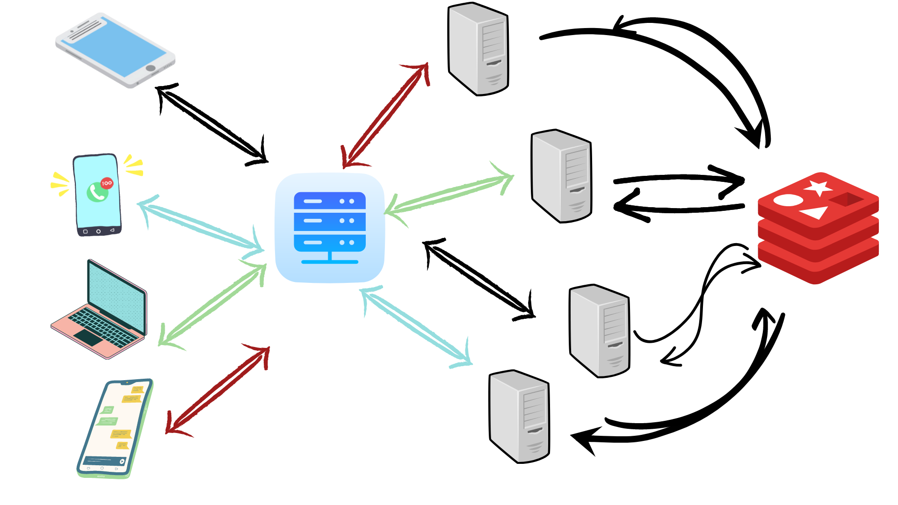

### Steps to run the project
1. clone this repo
2. cd scaleable-websocket
3. docker-compose up
4. open http://localhost:3000/room in two browsers and see the magic

### Project dependencies
1. docker-compose